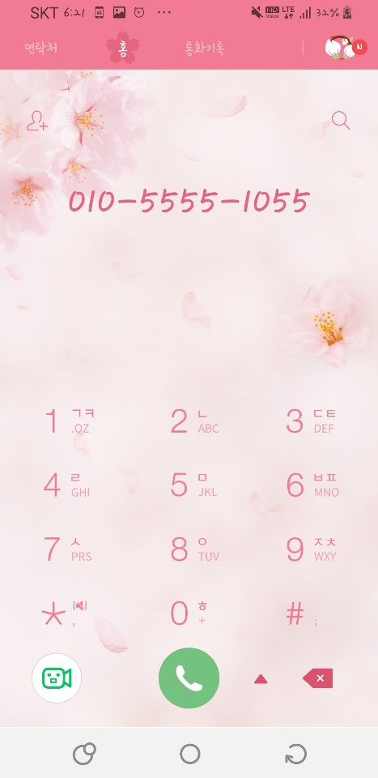

# 4. 여러 화면 간 전환하기

#### 4-1 레이아웃 인플레이션

- 인플레이션이란 ? 

  : XML 레이아웃의 내용이 메모리에 객체화되는 과정

  

- 메인 레이아웃 인플레이션 

  setContentView()

  :  메인 레이아웃을 설정하는 역할만을 수행한다.  -> 부분 레이아웃은 메모리에 객체화 시킬 수 없다.

  ex) Activity에서 onCreate 함수가 실행 될 때 Rayout을 정의 하여 사용

  ```java
  @Override
      protected void onCreate(Bundle savedInstanceState) {
          super.onCreate(savedInstanceState);
          setContentView(R.layout.activity_main);
          //activity_main이라는 layout를 ContentView로 정의
      }
  ```

  

- 부분 레이아웃 인플레이션

  : LayoutInflater 객체를 사용해 뷰 그룹 객체로 인플레이션한 후 메인 레이아웃에 추가해야 한다.

  ```java
  LayoutInflater inflater = (LayoutInflater) getSystemService(Context.LAYOUT_INFLATER_SERVICE);		
  
  inflater.inflate(R.layout.layout_name , null)
      //int resource, ViewGroup root를 인자로 사용
  ```
  
- inflate() 메서드
  
  : 첫 번째 파라미터로 XML 레이아웃 리소스을 두 번째 파라미터로 부모 컨테이너를 지정한다.
  
- LayoutInflater 객체 호출 방법
  
  1. 시스템 서비스에서 제공받기
  
       ```java
       getSystemService(Context.LAYOUT_INFLATER_SERVICE)
       ```
       
  2. LayoutInflater 클래스의 from() 메서드 사용하기
  
       ```java
       LayoutInflater.from(context)
       ```
  
       


#### 4-2 Activity 생성 및 Activity 간 전환

- Activity 란?

  : UI가 있는 화면을 제공하는 component! 

  시스템은 새로운 Activity을 시작하면 BackStack에 담고 나서 사용자에게 보여 준다. 

  BackStack은  "LIFO"의 스택 메커니즘을 따르며, 사용자가 ◀ 버튼을 누를 경우, 스택의 최상위(top)에 있는 현재 Activity을 제거(pop and destroy)하고 이전의 Activity을 시작한다.

- Activity의 생성
  - Activity Class의 상속

    : 안드로이드의 Activity에 대해 정의를 하기 위해서는 Activity 클래스을 상속 받아서 사용해야 한다.
    - **Activty 클래스(android.app.Activity)**

      : 해당 안드로이드 버전의 기본 라이브러리 액티비티 클래스이며, 모든 다른 액티비티 클래스는 이 클래스의 서브 클래스가 된다.

    - **FragmentActivty 클래스 (android.support.v4.app.FragmentActivity)**

      : 과거 버전과의 호환성을 유지하면서 프래그먼트를 사용할 때 필요한 액티비티 클래스다.

    - **AppCompatActivity 클래스 (android.app.support.v7.app.AppCompatActivity)**

      **최근에는 Default로 사용중**

      : 과거 안드로이드 버전과의 호환성을 유지하면서 새로운 버전의 기능도 사용할 수 있도록 만든 액티비티 클래스다. 이 클래스는 안드로이드 6.0(마시멜로)의 **새로운 기능**(Material Design 관련)도 많은 부분 구현하고 있다. 이런 이유로 안드로이드 스튜디오 1.5 버전부터는 프로젝트 생성 시에 액티비티를 **AppCompatActivity** 클래스의 서브 클래스로 생성해준다.

  - XML Layout 정의

    :  **UI 요소를 XML로 선언**. Android는 위젯과 레이아웃 등과 같이 View 클래스와 하위 클래스에 해당하는 간단한 XML 어휘를 제공한다. Android Studio의 [Layout Editor](https://developer.android.com/studio/write/layout-editor.html?hl=ko)를 사용하여 드래그 앤 드롭 인터페이스로 XML 레이아웃을 빌드할 수도 있다.

    ```xml
    <?xml version="1.0" encoding="utf-8"?>
    <LinearLayout
        xmlns:android="http://schemas.android.com/apk/res/android"
        android:layout_width="match_parent"
        android:layout_height="match_parent">
    
        <TextView
            android:layout_width="wrap_content"
            android:layout_height="wrap_content"
            android:text="Hello XML Layout!!"
            />
    
    </LinearLayout>
    ```

  - Activity에 Layout Resource 정의

    : 사용할 Layout에 대해 정의를 하고 Layout에 있는 객체에 접근 하여 이벤트를 정의가 가능 앞에서 설명한 **"메인 레이아웃 인플레이션"**에서 사용한 방법을 통해 정의

  - AndroidManifest.xml에 Activity 정의

    : AndroidManifest.xml은 app의 필요한 정보(실행되기 전에 시스템에서 반드시 필요한 정보가 무엇인지)를 정의한다. 이때 Activity도 포함이 되는데 여기서 정의를 하지 않으면 사용이 불가능 하다.

    -  **정의 방법**

      : 아래와 같은 형태로 Activity 정의가 가능한데 이때 **\<application\>** 의 태그 내부에 들어가야 한다. 여기서 Activity에 대해 정의를 하는 것이 아닌 intent에 대해서도 정의가 가능 하다.

      ```xml
      <activity android:name=".MainActivity">
          <!-- android:name에 Activity를 지정해준다. -->
      	<intent-filter>
      		<action android:name="android.intent.action.MAIN" />
      		<category android:name="android.intent.category.LAUNCHER" />
      	</intent-filter>
      </activity>
      ```

  - Intent 생성 방법

    : Intent 객체를 생성하고 **startActivity(Intent 객체)**함수를 이용하여 생성이 가능!

    ```java
    Intent intent = new Intent(getApplicationContext(),TestActivity.class);
    startActivity(intent);
    ```

  - 간단한 Activity 전환 예제 코드

    1. xml layout 정의

       activity_main.xml

       ```xml
       <?xml version="1.0" encoding="utf-8"?>
       <LinearLayout
       xmlns:android="http://schemas.android.com/apk/res/android"
       android:layout_width="match_parent"
       android:layout_height="match_parent">
       
       <Button
           android:layout_width="match_parent"
           android:layout_height="wrap_content"
           android:id="@+id/btnNewIntent"
           android:text="New Intent!"/>
       	<!-- main에는 Button를 정의, 누르면 Intent를 이용하여 화면전환! -->
       </LinearLayout>
       ```

       activity_test.xml

       ```xml
       <?xml version="1.0" encoding="utf-8"?>
       <LinearLayout
           xmlns:android="http://schemas.android.com/apk/res/android"
           android:layout_width="match_parent"
           android:layout_height="match_parent">
       
           <TextView
               android:layout_width="wrap_content"
               android:layout_height="wrap_content"
               android:text="New Intent!"
               />
       </LinearLayout>
       ```

    2. Activity java 정의

       MainActivity.java

       ```java
       package dev.jaeseokim.androidstudy;
       
       import androidx.appcompat.app.AppCompatActivity;
       
       import android.content.Intent;
       import android.os.Bundle;
       import android.view.View;
       import android.widget.Button;
       
       public class MainActivity extends AppCompatActivity {
       
           @Override
           protected void onCreate(Bundle savedInstanceState) {
               super.onCreate(savedInstanceState);
               setContentView(R.layout.activity_main);
               Button newIntent = (Button) findViewById(R.id.btnNewIntent);
               //Button를 정의
               newIntent.setOnClickListener(new View.OnClickListener() {
                   @Override
                   public void onClick(View v) {
                       //버튼 이벤트 발생시 intent 생성
                       Intent intent = new Intent(getApplicationContext(),TestActivity.class);
                       startActivity(intent);
                   }
               });
           }
       }
       
       ```

       TestActivity.java

       ```java
       package dev.jaeseokim.androidstudy;
       
       import android.os.Bundle;
       
       import androidx.annotation.Nullable;
       import androidx.appcompat.app.AppCompatActivity;
       
       public class TestActivity extends AppCompatActivity {
       
           @Override
           protected void onCreate(@Nullable Bundle savedInstanceState) {
               super.onCreate(savedInstanceState);
               setContentView(R.layout.activity_test);
       
           }
       }
       ```

    3. AndroidManifest.xml에 Activity 정의

       AndroidManifest.xml

       ```xml
       <?xml version="1.0" encoding="utf-8"?>
       <manifest xmlns:android="http://schemas.android.com/apk/res/android"
           package="dev.jaeseokim.androidstudy">
       
           <application
               android:allowBackup="true"
               android:icon="@mipmap/ic_launcher"
               android:label="@string/app_name"
               android:roundIcon="@mipmap/ic_launcher_round"
               android:supportsRtl="true"
               android:theme="@style/AppTheme">
               <activity android:name=".MainActivity">
                   <intent-filter>
                       <action android:name="android.intent.action.MAIN" />
       
                       <category android:name="android.intent.category.LAUNCHER" />
                   </intent-filter>
               </activity>
               <activity android:name=".TestActivity"/>
           </application>
       </manifest>
       ```

    4.  작동 테스트

       

       


#### 4-3 인텐트 살펴보기

- 인텐트란 ? 

  : 앱 구성 요소 간에 작업 수행을 위한 정보를 전달하는 역할을 한다.

  ex )  바로 위에서 설명한 **"간단한 Activity 전환 예제 코드"**의 경우 startActivity()메서드를 호출하면서 인텐트가 시스템에 전달되어, 시스템이 그 인텐트 안에 들어있는 명령을 확인해 액티비티를 띄움!

  

- 인텐트 구성요소

  : 액션, 범주, 타입, 컴포넌트, 데이터 등등 ...

  - 액션

    :  수행할 기능을 의미한다.

    * Intent.ACTION_VIEW - 정보를 사용자에게 보여주고자 할 때. 

      ​	ex ) 사진을 갤러리 앱에서 보기 

    * Intent.ACTION_SEND - 다른 앱을 통해 데이터를 공유하고자 할 때.

      ​    ex ) 소셜 공유 앱 공유하기

    * [다양한 인텐트 액션 확인하기](https://comxp.tistory.com/243)

    ```java
    // 예시
    Intent intent = new Intent(Intent.ACTION_VIEW)
    ```

  - 범주

    : 액션이 실행되는데 필요한 추가적인 정보를 제공한다.

    (대부분의 경우 카테고리를 필요로 하지 않음.)

    ```java
    Intent intent = new Intent();
    intent.addCategory(Intent.CATEGORY_APP_BROWSER);	// 인텐트 객체에 카테고리 타입설정 
    ```

  - 타입 

    : 인텐트에 들어가는 데이터의 MIME 타입을 명시적으로 지정한다.

    : "http://" 또는 "video/mp4" 등과 같은 데이터 타입을 표현한다.

    ```JAVA
    // MIME 타입 설정
    Intent intent = new Intent()
    intent.setType("video/mp4")		// 인텐트 객체에 MIME 타입 설정
    ```

  - 컴포넌트

    : 인텐트에 사용될 컴포넌트 클래스 이름을 명시적으로 지정한다.

    : 파라미터는 ("패키지이름" , "패키지이름 + 클래스이름")

    ```java
    Intent intent = new intent();
    ComponentName name = new ComponentName("com.example.test","com.example.test.testActivity"); 
    // 컴포넌트 이름을 지정할 수 있는 객체 생성
    
    intent.setComponent(name)	// 인텐트 객체에 컴포넌트 설정
    startAvtivity(intent)
    ```

  - 데이터

    : 액션에 관련된 데이터의 URI와 그 데이터에 대한 MIME타입을 말한다.

    ```java
    Intent intent = new Intent();
    Uri uri = new Uri.parse("content://com.example.project/etc");
    intent.setData(uri)	// 인텐트 객체에 uri 설정
    ```

    * URI가 비슷한 이미지나 동영상의 경우에 MIME 타입 이용한다.

    * MIME 타입을 URI 로 부터 추론할 수 있는 경우도 있다.

      EX) URI가 content:로 시작하면 디바이스의 로컬 저장소에 저장된 데이터라고 추론

      

  ​     [ 액션, 플레그, 카테고리 종류 확인 하기 ](https://kairo96.gitbooks.io/android/content/ch2.8.html) 

  

- 인텐트의 종류

  : 명시적 인텐트, 암시적 인텐트 

  1. 명시적 인텐트 

     : 인텐트에 클래스 객체나 컴포넌트 이름을 지정하여 호출할 대상을 확실히 알 수 있는 경우

      위에  **간단한 Activity 전환 예제 코드** 설명에서 확인할 수 있다.

     ```JAVA
     Intent intent = new Intent(this, TestActivity.class);
     startActivity(intent);
     ```

     

  2. 암시적 인텐트

     : 액션과 데이터를 지정하긴 했지만 호출할 대상이 달라질 수 있는 경우

     ```java
     String data = editText.getText().toString();	// 입력상자에서 DATA 받기
     
     Intent intent = new Intent(Intent.ACTION_VIEW, Uri.parse(data));
     startActivity(intent)
     ```

     ->  MIME타입에 따라 시스템에서 적절한 다른 앱의 액티비티를 찾은 후 띄우는 방식

     * 간단한 예제 코드

       1.  Activity_main.xml

       ```java
       <?xml version="1.0" encoding="utf-8"?>
       <LinearLayout xmlns:android="http://schemas.android.com/apk/res/android"
           xmlns:app="http://schemas.android.com/apk/res-auto"
           xmlns:tools="http://schemas.android.com/tools"
           android:layout_width="match_parent"
           android:layout_height="match_parent"
           android:orientation="vertical"
           tools:context=".MainActivity">
       
           <EditText
               android:layout_width="match_parent"
               android:layout_height="wrap_content"
               android:text="tel:010-5555-1055"
               android:id="@+id/edittext"
               android:textSize="30sp"/>
           <Button
               android:layout_width="wrap_content"
               android:layout_height="wrap_content"
               android:id="@+id/button"
               android:text="전화걸기"/>
       
       </LinearLayout>
       ```

       2. MainAcitvity.java

       ```java
       public class MainActivity extends AppCompatActivity {
           EditText editText;
       
           @Override
           protected void onCreate(Bundle savedInstanceState) {
               super.onCreate(savedInstanceState);
               setContentView(R.layout.activity_main);
       
               editText = (EditText)findViewById(R.id.edittext);
               Button button = (Button)findViewById(R.id.button);
               button.setOnClickListener(new View.OnClickListener() {
                   @Override
                   public void onClick(View v) {
                       String tel = editText.getText().toString();
       
                       Intent intent = new Intent(Intent.ACTION_VIEW, Uri.parse(tel));
                       startActivity(intent);
                   }
               });
       
           }
       }
       
       ```

       3. 작동 테스트

          

     


​											  

