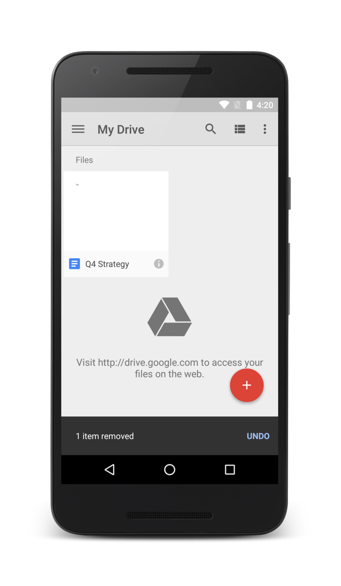

# **Overview of App Widgets**

위젯이란 사용자의 홈 화면에서 바로 접근이 가능한, 앱의 '한눈에 보기'라고 할 수 있다. 사용자의 스타일에 따라 홈 화면에 맞춤설정을 할 수 있다. 홈 화면의 패널간 위젯을 자유로이 이동할 수 있으며 크기조절을 통해 정보량을 조절 가능한 위젯도 있다.


## Types of Widget

위젯의 종류는 다음과 같다.

- ### Information Widgets

  정보 위젯은 보통 사용자에게 중요한 정보를 표시한다. 시간에 따를 정보 변화를 추적한다. 날씨 위젯, 시계 위젯, 스포츠 경기 점수 위젯이 대표적인 예시이다. 일반적으로 이러한 위젯을 터치하면 연결된 앱이 실행되고 이에 맞는 상세정보가 나온다.

  

- ### Collection Widgets

  콜렉션 위젯은 갤러리의 사진, 뉴스 기사, 이메일, 메시지 등 동일한 유형의 여러 요소를 표시하기에 최적화 되어있다. 콜렉션 위젯은 일반적으로 콜렉션 둘러보기, 세부정보 뷰로 열기 등 두 가지 사용 예시에 중점을 둔다.

  

- ### Control Widgets

  컨트롤 위젯의 기본 목적은 빠른 실용성이다. 앱을 열 필요 없이 홈 화면에서 바로 트리거할 수 있는 자주 사용되는 함수를 표시하는 것이다. 컨트롤 위젯의 예시로는는 음악 재생, 일시중지, 곡이동 등이 가능한 음악 앱이다.

  

- ### Hybrid Widgets

  모든 위젯들은 위의 세 가지 종류 중 하나의 성향이 있지만 실제로는 대부분의 위젯들이 다양한 유형의 요소를 결합한 하이브리드 위젯이다. 예를들어 음악 앱의 위젯은 기본적으로 컨트롤 위젯이지만 현재 재생중인 음악을 사용자에게 알려주는 정보 위젯의 역할도 한다.


## Limitations of Widget

위젯의 제한사항은 다음과 같다.

### 제스쳐

위젯에서 사용할 수 있는 제스쳐는 터치와 수직 스와이프로 두가지이다.


------

# **Let's build an App Widget**


## 기본 사항

앱 위젯을 만들기 위해서는 다음이 필요하다.

- `AppWidgetProviderInfo` 객체

  앱 위젯의 레이아웃, 업데이트 빈도, AppWidgetProvider 클래스 등 앱 위젯의 메타데이터를 설명한다. XML로 정의해야 한다.

- `AppWidgetProvider` 클래스 구현

  브로드캐스트 이벤트를 기반으로 앱 위젯과 프로그래매틱 방식으로 접속할 수 있는 기본적인 방법을 정의한다. 이를 통해 앱 위젯이 업데이트, 사용 설정, 사용 중지, 삭제될 때 브로드캐스트를 수신하게 된다.

  
### 레이아웃 보기

XML로 정의된 앱 위젯의 초기 레이아웃을 정의한다.

또한 앱 위젯 구성 활동을 구현할 수 있다. 사용자가 앱 위젯을 추가할 때 실행되고 작성 시 사용자가 앱 위젯 설정을 수정할 수 있도록 하는 선택적 `Activity`이다.


## Manifest에서 앱 위젯 선언

먼저 애플리케이션의 `AndroidManifest.xml` 파일에서 `AppWidgetProvider` 클래스를 선언한다.

```xml
    <receiver android:name="DaigakuAppWidgetProvider" >
        <intent-filter>
            <action android:name="android.appwidget.action.APPWIDGET_UPDATE" />
        </intent-filter>
        <meta-data android:name="android.appwidget.provider"
                   android:resource="@xml/daigaku_appwidget_info" />
    </receiver>
```

`<receiver>` 요소에는 앱 위젯에서 사용하는 `AppWidgetProvider`를 지정하는 `android:name` 속성이 필요하다.

`<intent-filter>`요소에는 `android:name` 속성이 있는 `<action>` 요소를 포함해야 한다. 이 속성은 `AppWidgetProvider`에서 `ACTION_APPWIDGET_UPDATE` 브로드캐스트를 허용한다는 것을 지정한다.  `AppWidgetManager`는 필요한 경우 다른 모든 앱 위젯 브로드캐스트를 AppWidgetProvider로 자동 전송한다.

`<meta-data>` 요소는 `AppWidgetProviderInfo` 리소스를 지정하며 다음과 같은 속성이 필요하다.

- `android:name` - 메타데이터 이름을 지정한다. 데이터를 `AppWidgetProviderInfo` 설명자로 표시하려면 `android.appwidget.provider`를 사용한다.

- `android:resource` - `AppWidgetProviderInfo` 리소스 위치를 지정한다.

  

## AppWidgetProviderInfo 메타데이터 추가

`AppWidgetProviderInfo`는 최소 레이아웃 크기, 초기 레이아웃 리소스, 앱 위젯을 업데이트하는 빈도, 작성 시 실행할 구성 활동(선택사항) 등 앱 위젯의 기본적인 특성을 정의한다. XML 리소스에서 단일 `<appwidget-provider>` 요소를 사용하여 AppWidgetProviderInfo 객체를 정의하고 프로젝트의 `res/xml/` 폴더에 저장한다.

```xml
    <appwidget-provider xmlns:android="http://schemas.android.com/apk/res/android"
        android:minWidth="40dp"
        android:minHeight="40dp"
        android:updatePeriodMillis="43200000"
        android:previewImage="@drawable/preview"
        android:initialLayout="@layout/daigaku_appwidget"
        android:configure="com.daigaku.android.DaigakuAppWidgetConfigure"
        android:resizeMode="horizontal|vertical"
        android:widgetCategory="home_screen">
    </appwidget-provider>
    
```

다음은 `<appwidget-provider>` 속성의 요약이다.

- `minWidth` 및 `minHeight` 속성의 값은 앱 위젯에서 기본적으로 사용하는 공간의 최소 크기를 지정한다. 기본 홈 화면은 높이와 너비가 정의된 셀의 그리드를 기반으로 창에 앱 위젯을 배치한다. 앱 위젯의 최소 너비 또는 높이 값이 셀의 크기와 일치하지 않으면 앱 위젯 크기가 가장 가까운 셀 크기로 반올림된다.

- `minResizeWidth` 및 `minResizeHeight` 속성은 앱 위젯의 절대 최소 크기를 지정한다. 앱 위젯의 크기가 이 값보다 작으면 앱 위젯을 알아볼 수 없거나 사용할 수 없다. 이러한 속성을 사용하면 사용자가 위젯의 크기를 `minWidth` 및 `minHeight` 속성에 의해 정의된 기본 위젯 크기보다 작게 조정할 수 있다.

- `updatePeriodMillis` 속성은 앱 위젯 프레임워크에서 `onUpdate()` 콜백 메서드를 호출하여 `AppWidgetProvider`에 업데이트를 요청해야 하는 빈도를 정의한다. 정의된 빈도에 따라 제시간에 정확히 실제 업데이트가 발생하지 않을 수도 있으며 배터리를 절약하기 위해 업데이트 주기를 최대한 길게 하여 한 시간에 한 번만 업데이트하는 것이 좋다. 사용자가 구성에서 빈도를 조정하도록 할 수도 있다.

- `initialLayout` 속성은 앱 위젯 레이아웃을 정의하는 레이아웃 리소스를 가리킨다.
- `configure` 속성은 사용자가 앱 위젯을 추가할 때 앱 위젯 속성을 구성하기 위해 실행할 수 있는 `Activity`를 정의한다. 이 속성은 선택사항이다.
- `previewImage` 속성은 앱 위젯이 구성된 후 사용자가 앱 위젯을 선택할 때 표시되는 앱 위젯의 미리보기를 지정한다. 미리보기가 제공되지 않은 경우 애플리케이션의 런처 아이콘이 대신 표시된다. 이 필드는 `AndroidManifest.xml` 파일에 있는 `<receiver>` 요소의 `android:previewImage` 속성에 해당한다.
- `autoAdvanceViewId` 속성은 위젯의 호스트에서 자동으로 진행해야 하는 앱 위젯 하위 뷰의 뷰 ID를 지정한다.
- `resizeMode` 속성은 위젯의 크기를 조절할 수 있는 규칙을 지정한다. 이 속성을 사용하여 홈 화면 위젯의 크기를 가로, 세로 또는 두 축 모두의 방향으로 조절 가능하도록 만들 수 있다. 사용자는 위젯을 길게 터치하여 크기 조절 핸들을 표시한 다음 가로 및 세로 핸들을 드래그하여 레이아웃 그리드에서 크기를 변경한다. `resizeMode` 속성 값에는 'horizontal', 'vertical', 'none'이 포함된나. 위젯의 크기를 가로 및 세로로 조절 가능하도록 선언하려면 값을 'horizontal|vertical'로 지정한다.
- `minResizeHeight` 속성은 위젯의 크기를 조절할 수 있는 최소 높이를 dps 단위로 지정한다. 이 필드는 `minHeight`보다 크거나 세로 크기 조절이 사용 설정되지 않은 경우 효과가 없다.
- `minResizeWidth `속성은 위젯의 크기를 조절할 수 있는 최소 너비를 dps 단위로 지정한다. 이 필드는 `minWidth`보다 크거나 가로 크기 조절이 사용 설정되지 않은 경우 효과가 없다.
- `widgetCategory` 속성은 앱 위젯을 홈 화면(`home_screen`), 잠금 화면(`keyguard`) 또는 둘 다에 표시할 수 있는지 여부를 선언한다.


------

# **Drawable**

말 그대로 Draw 그리다, Able 할 수 있다의 합성어로 앱 내에서 그래픽 리소스에 해당한다.

## Types of Drawable

드로어블의 종류에는 비트맵 파일, 트랜지션 드로어블, 배율 조정 드로어블, 세이프 드로어블 등 여러가지가 존재한다.

프로젝트 리소스에서 앱에 그래픽을 추가할 수 있습니다. 지원되는 파일 형식은 PNG(권장), JPG(허용), GIF(권장되지 않음)이다.

이미지 리소스를 사용하려면 프로젝트의 `res/drawable/` 디렉터리에 파일을 추가해야한다.


------

# **Toast**

토스트는 작은 팝업으로 작업에 관한 간단한 피드백 메시지를 제공한다. 토스트가 표시되는 동안 백그라운드에 앱이 그대로 표시된다. 토스트는 시간이 초과하면 자동으로 사라진다.

예를 들어, 이메일에서 **Send**를 클릭하면 '메시지를 보내는 중...'이라는 토스트가 나타나게된다.


## Basic

```java
    Context context = getApplicationContext();
    CharSequence text = "I am not nihonjin";
    int duration = Toast.LENGTH_SHORT;

    Toast toast = Toast.makeText(context, text, duration);
    toast.show();    
```

`int duration` 의 속성을 바꾸어 토스트 시간을 변경할 수 있다.

## 토스트 위치 지정

일반적인 토스트 알림은 화면 아래, 가운데 정렬로 표시된다. `setGravity(int, int, int)` 메서드를 사용하여 위치변경이 가능하다. 이 메서드는 `Gravity` 상수, x-좌표 오프셋, y-좌표 오프셋을 사용한다.

예를 들어, 토스트를 오른쪽 상단에 표시하려면 중력을 다음과 같이 설정하면 된다.

```java
    toast.setGravity(Gravity.TOP|Gravity.RIGHT, 0, 0);
```

위치를 오른쪽으로 조금 이동하려면 x 매개변수의 값을 늘립니다. 아래로 조금 이동하려면 y 매개변수의 값을 늘린다.


------

# **Snackbar**

간단히 말해서 Toast의 업그레이드 버전이다. Android 5.0 부터 도입되었다.

Toast와 마찬가지로 Snackbar가 표시된 동안 기존 앱의 활동은 유지가 가능하고 잠시 후에 Snackbar가 자동으로 닫힌다.



Toast와의 가장 큰 차이점을 꼽자면 추가적으로 이벤트 처리가 가능하다는것이다.


```java
Snackbar mySnackbar = Snackbar.make(view, stringId, duration); //LENGTH_SHORT etc
mySnackbar.show();
```


------

# Dialog


주 사용하는 다이얼 로그 간단한 예제와 커스텀 다이얼 로그에 대해서 설명 하도록 하겠습니다.

(다른데서 퍼옴)

> **1. 일반 Dialog**


일반적으로 알림/경고 용도로 많이 사용하고 있는 팝업창이다.

확인,취소 버튼을 표시하고 선택에 따라 행동하는 상황에서 많이 사용하게된다.


```java
AlertDialog.Builder oDialog = new AlertDialog.Builder(this,
                                          android.R.style.Theme_DeviceDefault_Light_Dialog);

oDialog.setMessage("앱을 종료하시겠습니까?")
       .setTitle("일반 Dialog")
       .setPositiveButton("아니오", new DialogInterface.OnClickListener()
        {
            @Override
            public void onClick(DialogInterface dialog, int which)
            {
                Log.i("Dialog", "취소");
                Toast.makeText(getApplicationContext(), "취소", Toast.LENGTH_LONG).show();
            }
        })
       .setNeutralButton("예", new DialogInterface.OnClickListener()
       {
            public void onClick(DialogInterface dialog, int which)
            {
                m_oMainActivity.finish();
            }
        })
        .setCancelable(false) // 백버튼으로 팝업창이 닫히지 않도록 한다.
       .show();
```

AlertDialog.Builder 를 생성할 때 생성자 두번째 인자에 테마를 지정할 수 있다.


```java
AlertDialog.Builder oDialog = new AlertDialog.Builder(this,
                     android.R.style.Theme_DeviceDefault_Light_Dialog);
```


만약 테마를 지정 하지 않을 경우 아래와 같은 이미지가 나오게 된다.

```java
AlertDialog.Builder oDialog = new AlertDialog.Builder(this);
```


> **2. 목록 선택 Dialog**


여러항목 중 하나를 선택 할 수 있는 팝업창 이다.. 취소는 할 수 없다. 백버튼으로 선택을 안 할 수 있지만 setCancelable 메소드를 사용하게 되면 백버튼도 되지 않는다.

```java
final CharSequence[] oItems = {"하나", "둘", "셋", "넷", "다셋"};

AlertDialog.Builder oDialog = new AlertDialog.Builder(this, 
                                    android.R.style.Theme_DeviceDefault_Light_Dialog_Alert);

oDialog.setTitle("색상을 선택하세요")
        .setItems(oItems, new DialogInterface.OnClickListener()
        {
            @Override
            public void onClick(DialogInterface dialog, int which)
            {
                Toast.makeText(getApplicationContext(), 
                                  oItems[which], Toast.LENGTH_LONG).show();
            }
        })
        .setCancelable(false)
        .show();
```


> **3. 라디오 버튼 Dialog**

라디오 버튼을 이용하여 항목을 선택하는 팝업창을 표시한다.

일반 Dialog 는 확인/취소 버튼만 존재하여 두가지 선택만 할 수있고, 목록 선택 Dialog는 여러항목이 있지만 취소를 할 수 없다.

라디오 버튼 Dialog는 여러항목을 보여주며 선택 후 확인을 눌러야 팝업이 닫히는 Dialog 이다.


 

```java
  final CharSequence[] oItems = {"하나", "둘", "셋", "넷", "다셋"};


  AlertDialog.Builder oDialog = new AlertDialog.Builder(this,
                                   android.R.style.Theme_DeviceDefault_Light_Dialog_Alert);

  oDialog.setTitle("색상을 선택하세요")
          .setSingleChoiceItems(oItems, -1, new DialogInterface.OnClickListener()
          {
              @Override
              public void onClick(DialogInterface dialog, int which)
              {
                  nSelectItem = which;
              }
          })
          .setNeutralButton("선택", new DialogInterface.OnClickListener()
          {
              public void onClick(DialogInterface dialog, int which)
              {
                  if (which >= 0)
                      Toast.makeText(getApplicationContext(),
                                           oItems[nSelectItem], Toast.LENGTH_LONG).show();
              }
          })
          .setCancelable(false)
          .show();
```


> **4. HTML Dialog**


팝업 내용을 HTML로 표현 할 때 사용하는 팝업창이다.

장점으로는 텍스트 내용 중간에 색상 변경 등 CSS 를 사용할 수 있다는 장점이 있다.

```java
AlertDialog.Builder oDialog = new AlertDialog.Builder(this, 
                                 android.R.style.Theme_DeviceDefault_Light_Dialog_Alert);

String strHtml = 
      "<b><font color='#ff0000'>HTML 컨텐츠 팝업</font></b> 입니다.<br/>HTML이 제대로 표현되나요?";
Spanned oHtml;

if (android.os.Build.VERSION.SDK_INT < android.os.Build.VERSION_CODES.N) {
    // noinspection deprecation
    oHtml = Html.fromHtml(strHtml);
}
else
{
    oHtml = Html.fromHtml(strHtml, Html.FROM_HTML_MODE_LEGACY);
}

oDialog.setTitle("색상을 선택하세요")
       .setMessage(oHtml)
       .setPositiveButton("ok", null)
       .setCancelable(false)
       .show();
```

 

> **5. 날짜 Dialog**


날짜를 선택하는 Picker 팝업창 이다.

```java
Calendar c = Calendar.getInstance();
int nYear = c.get(Calendar.YEAR);
int nMon = c.get(Calendar.MONTH);
int nDay = c.get(Calendar.DAY_OF_MONTH);

DatePickerDialog.OnDateSetListener mDateSetListener =
        new DatePickerDialog.OnDateSetListener() {
            public void onDateSet(DatePicker view, int year, int monthOfYear, 
                                  int dayOfMonth) {
                String strDate = String.valueOf(year) + "년 ";
                strDate += String.valueOf(monthOfYear+1) + "월 ";
                strDate += String.valueOf(dayOfMonth) + "일";


               Toast.makeText(getApplicationContext(), strDate, Toast.LENGTH_SHORT).show();
            }
        };

DatePickerDialog oDialog = new DatePickerDialog(this, 
                          android.R.style.Theme_DeviceDefault_Light_Dialog, 
                         mDateSetListener, nYear, nMon, nDay);
oDialog.show();
```


> **6. 시간 Dialog**


시간을 선택하는 팝업창 이다.

```java
TimePickerDialog.OnTimeSetListener mTimeSetListener =
        new TimePickerDialog.OnTimeSetListener() {
            public void onTimeSet(TimePicker view, int hourOfDay, int minute) {
                Toast.makeText(getApplicationContext(),
                        hourOfDay + ":" + minute, Toast.LENGTH_SHORT)
                        .show();
            }
        };

TimePickerDialog oDialog = new TimePickerDialog(this, 
                            android.R.style.Theme_DeviceDefault_Light_Dialog, 
                            mTimeSetListener, 0, 0, false);
oDialog.show();
```


> **7. 프로그레스(Progress) Dialog**


프로그레스 바를 표시해주는 Dialog Box 이다.

```java
ProgressDialog oDialog = new ProgressDialog(this, 
                                        android.R.style.Theme_DeviceDefault_Light_Dialog);
oDialog.setProgressStyle(ProgressDialog.STYLE_SPINNER);
oDialog.setMessage("잠시만 기다려 주세요.");

oDialog.show();
```


> **8. 로딩바 Dialog**


Html 코드를 이용하여 색상, 크기등을 설정하여 표시해 줄 수 있다.

```java
final ProgressDialog oDialog = new ProgressDialog(this, 
                                        android.R.style.Theme_DeviceDefault_Light_Dialog);
oDialog.setProgressStyle(ProgressDialog.STYLE_HORIZONTAL);
oDialog.setMessage("로딩중..");
oDialog.setMax(200);

oDialog.show();

// Progress 증가 시키기.
oDialog.setProgress(111);
```


> **9. Custom Dialog**


```java
public class CustomDialog extends Dialog
{
    CustomDialog m_oDialog;
    public CustomDialog(Context context)
    {
        super(context, android.R.style.Theme_Translucent_NoTitleBar);
    }

    @Override
    protected void onCreate(Bundle savedInstanceState)
    {
        super.onCreate(savedInstanceState);

        WindowManager.LayoutParams lpWindow = new WindowManager.LayoutParams();
        lpWindow.flags = WindowManager.LayoutParams.FLAG_DIM_BEHIND;
        lpWindow.dimAmount = 0.5f;
        getWindow().setAttributes(lpWindow);

        setContentView(R.layout.custom_dialog);

        m_oDialog = this;

        TextView oView = (TextView) this.findViewById(R.id.textView);
        oView.setText("Custom Dialog\n테스트입니다.");

        Button oBtn = (Button)this.findViewById(R.id.btnOK);
        oBtn.setOnClickListener(new View.OnClickListener()
        {
            @Override
            public void onClick(View v)
            {
                onClickBtn(v);
            }
        });
    }

    public void onClickBtn(View _oView)
    {
        this.dismiss();
    }
}
```

Custom Dialog 를 호출

```java
CustomDialog oDialog = new CustomDialog(this);
oDialog.setCancelable(false);
oDialog.show();
```


